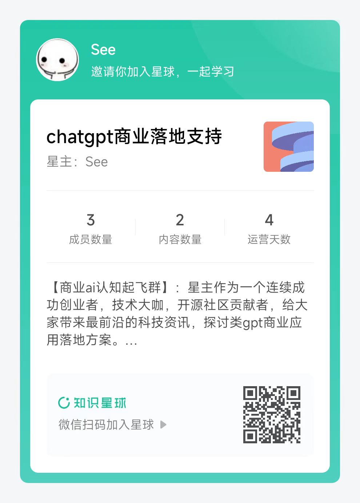

<p align="center">
  
</p>

<p align="center">
  <em>🤖 在你的浏览器中组装、配置和部署自主AI代理。 🤖 </em>
</p>

<p align="center">
    
</p>

<p align="center">
<a href="https://agentgpt.reworkd.ai">🔗 短链接</a>
<span>&nbsp;&nbsp;•&nbsp;&nbsp;</span>
<a href="#-getting-started">🤝 贡献</a>
<span>&nbsp;&nbsp;•&nbsp;&nbsp;</span>
<a href="https://twitter.com/asimdotshrestha/status/1644883727707959296">🐦 推特</a>
<span>&nbsp;&nbsp;•&nbsp;&nbsp;</span>
<a href="https://discord.gg/3PccggEG">📢 Discord</a>
</p>

---

AgentGPT可以让你配置和部署自主AI代理。   
给你的定制AI命名，并让它追求任何想象得到的目标。   
它将尝试通过思考要做的任务、执行这些任务并从结果中学习来实现目标 🚀。   

## 感谢

项目大部分翻译自[AgentGPT](https://github.com/reworkd/AgentGPT).  实际项目部署，请移步到[AgentGPT](https://github.com/reworkd/AgentGPT).  
[英文版本demo体验地址](https://agentgpt.reworkd.ai/).  

## 国内交流群

群主会不定期发布 各类亮眼项目体验版本 供大家体验，星球会不定期发布一些商业化的 AI 工具。欢迎各位读者老爷，漂亮姐姐给我的项目点赞！

|              直接加群               |                 如果前面的过期，加我拉你入群                  |                      知识星球                       |
|:-------------------------------:|:-----------------------------------------------:|:-----------------------------------------------:|
|  |  |  |


<h2 align="center">
💝 支持AgentGPT的进展!! 💝
</h2>

<p align="center">
加入我们，共同推动开源项目AgentGPT的发展，这是一个突破人工智能自主性的项目！我们正面临着运营成本的挑战 💸，包括内部API和其他基础设施开销，预计每天将增长到约150美元💳🤕。您的赞助将通过帮助我们扩展资源、增强功能和性能以及继续对这个激动人心的项目进行迭代，推动进展🚀。
</p>

<p align="center">
通过赞助这个免费开源项目，您不仅有机会在下面展示您的头像/徽标，还可以获得与创始人独家交流的机会！🗣️
</p>

<p align="center">
<a href="https://github.com/sponsors/reworkd-admin">👉 点此</a>支持这个项目
</p>


## 🎉 发展路线

该平台目前处于beta版，我们正在努力：

- 通过向量DB实现长期记忆 🧠
- 通过langchain实现网页浏览能力 🌐
- 与网站和人互动 👨‍👩‍👦
- 通过文档API实现写作能力 📄
- 保存代理运行 💾
- 用户和身份验证 🔐
- Stripe集成用于低限额付费版本（以便我们不必担心基础设施成本）💵

更多即将推出...

## 🚀 技术栈

- ✅ **引导程序**：[create-t3-app](https://create.t3.gg)。
- ✅ **框架**：[Nextjs 13 + Typescript](https://nextjs.org/)。
- ✅ **认证**：[Next-Auth.js](https://next-auth.js.org)
- ✅ **ORM**：[Prisma](https://prisma.io)。
- ✅ **数据库**：[Supabase](https://supabase.com/)。
- ✅ **样式**：[TailwindCSS + HeadlessUI](https://tailwindcss.com)。
- ✅ **Typescript模式验证**：[Zod](https://github.com/colinhacks/zod)。
- ✅ **端到端类型安全API**：[tRPC](https://trpc.io/)。

## 👨‍🚀 入门指南

### 🐳 Docker设置

在本地运行AgentGPT的最简单方法是使用docker。
提供了一个方便的设置脚本，帮助您入门。

```bash
./setup.sh --docker
```

### 👷 本地开发设置

如果你想在本地开发AgentGPT，最简单的方法就是
使用提供的设置脚本。

```bash
./setup.sh --local
```

### 🛠️ 手动设置

> 🚧 你需要安装 [Nodejs +18 (建议使用LTS版本)](https://nodejs.org/en/)。

1. Fork这个项目：

- [点击这里](https://github.com/reworkd/AgentGPT/fork)。

2. 克隆仓库：

```bash
git clone git@github.com:YOUR_USER/AgentGPT.git
```

3. 安装依赖：

```bash
cd AgentGPT
npm install
```

4. 创建一个包含以下内容的**.env**文件：

> 🚧 环境变量必须与以下[schema](https://github.com/reworkd/AgentGPT/blob/main/src/env/schema.mjs)匹配。

```bash
# 部署环境:
NODE_ENV=development

# Next Auth配置：
# 使用`openssl rand -base64 32`生成一个密钥
NEXTAUTH_SECRET=changeme
NEXTAUTH_URL=http://localhost:3000
DATABASE_URL=file:./db.sqlite

# 你的open api key
OPENAI_API_KEY=changeme
```

5. 修改prisma schema以使用sqlite：

```bash
./prisma/useSqlite.sh
```

**注意：**只有在想要使用sqlite时才需要执行此操作。

6. 准备好了🥳，现在运行：

```bash
# 创建数据库迁移
npx prisma db push

# 运行项目：
npm run dev
```

